# 调试记录

## helloTP

从入口文件开始调试.

```php
<?php
namespace think;
require __DIR__ . '/../thinkphp/base.php';
Container::get('app')->run()->send();
```

#### base.php

跟进base.php,主要是完成了自动加载,错误处理,日志等机制. 没什么内容

```php
<?php
namespace think;
// 载入Loader类
require __DIR__ . '/library/think/Loader.php';
// 注册自动加载
Loader::register();
// 注册错误和异常处理机制
Error::register();
// 实现日志接口
if (interface_exists('Psr\Log\LoggerInterface')) {
    interface LoggerInterface extends \Psr\Log\LoggerInterface
    {}
} else {
    interface LoggerInterface
    {}
}
// 注册类库别名
Loader::addClassAlias([
    'App'      => facade\App::class,
    'Build'    => facade\Build::class,
    'Cache'    => facade\Cache::class,
    'Config'   => facade\Config::class,
    'Cookie'   => facade\Cookie::class,
    'Db'       => Db::class,
    'Debug'    => facade\Debug::class,
    'Env'      => facade\Env::class,
    'Facade'   => Facade::class,
    'Hook'     => facade\Hook::class,
    'Lang'     => facade\Lang::class,
    'Log'      => facade\Log::class,
    'Request'  => facade\Request::class,
    'Response' => facade\Response::class,
    'Route'    => facade\Route::class,
    'Session'  => facade\Session::class,
    'Url'      => facade\Url::class,
    'Validate' => facade\Validate::class,
    'View'     => facade\View::class,
]);
```

跟进`Container::get('app')->run()->send();`

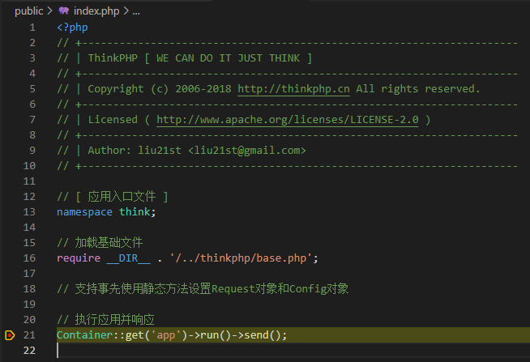

#### Container::get('app')

> 关于Container类 :  https://blog.csdn.net/qq_36172443/article/details/82667427
> 正如它的名字一样,它就是一个class/对象的容器,负责make(创建/实例化)一个class. tp框架中用Container类管理各种类的对象并用它实现依赖注入

利用自动加载机制先加载`think\Container`类, 再调用其get方法.

Container::get

```php
public static function get($abstract, $vars = [], $newInstance = false)
{
    return static::getInstance()->make($abstract, $vars, $newInstance);
}
```

`static::getInstance()` 使Container类以单例形式存在, 具体代码如下:

```php
public static function getInstance()
{
    if (is_null(static::$instance)) {
        static::$instance = new static;
    }

    return static::$instance;
}
```

然后调用Container实例的的make方法实例化app类

```php
public function make($abstract, $vars = [], $newInstance = false)
{
    if (true === $vars) {
        // 总是创建新的实例化对象
        $newInstance = true;
        $vars        = [];
    }

    $abstract = isset($this->name[$abstract]) ? $this->name[$abstract] : $abstract;
	// 保证单例
    if (isset($this->instances[$abstract]) && !$newInstance) {
        return $this->instances[$abstract];
    }

    if (isset($this->bind[$abstract])) { // 判断是否是别名
        $concrete = $this->bind[$abstract]; // think\App

        if ($concrete instanceof Closure) { // 判断闭包
            $object = $this->invokeFunction($concrete, $vars);
        } else {
            $this->name[$abstract] = $concrete;
            return $this->make($concrete, $vars, $newInstance);
        }
    } else {
        // 调用反射执行类的实例化 支持依赖注入
        $object = $this->invokeClass($abstract, $vars);
    }

    if (!$newInstance) {
        $this->instances[$abstract] = $object;
    }

    return $object;
}
```

如果是别名,则赋值为完整命名空间后再次调用make函数,进入invokeClass函数实例化这个对象

最终返回think\App类的实例化对象

#### App->run()

首先执行`$this->initialize();` , 跟进发现主要是加载配置文件和设置环境变量 , 感觉没什么重要的, 就不仔细看了

跳过一些代码,到`$dispatch = $this->routeCheck()->init();` 返回一个module实例, 暂时还不清楚其作用,猜测是调用对象控制器的对应方法

```php
$dispatch = $this->dispatch;
if (empty($dispatch)) {
    // 路由检测
    $dispatch = $this->routeCheck()->init();
}
```

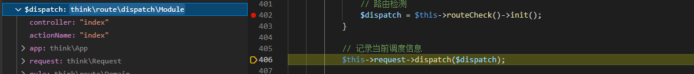

省略一些代码:

```php
$this->middleware->add(function (Request $request, $next) use ($dispatch, $data) {
	return is_null($data) ? $dispatch->run() : $data;
});

$response = $this->middleware->dispatch($this->request);
```

添加了一个匿名函数到middleware,内容是执行$dispatch(module)的run方法

然后下面`$response = $this->middleware->dispatch($this->request);`依次执行中间件和`module->run()`

直接在`return is_null($data) ? $dispatch->run() : $data;`这行下断点, 并跟进到run方法

```php
public function run()
{
    $option = $this->rule->getOption();

    // 检测路由after行为
    if (!empty($option['after'])) {
        $dispatch = $this->checkAfter($option['after']);

        if ($dispatch instanceof Response) {
            return $dispatch;
        }
    }

    // 数据自动验证
    if (isset($option['validate'])) {
        $this->autoValidate($option['validate']);
    }

    $data = $this->exec();

    return $this->autoResponse($data);
}
```

跟进`$data = $this->exec();`

```php
public function exec()
{
    // 监听module_init
    $this->app['hook']->listen('module_init');
    try {
        // 实例化控制器
        $instance = $this->app->controller($this->controller,
                                           $this->rule->getConfig('url_controller_layer'),
                                           $this->rule->getConfig('controller_suffix'),
                                           $this->rule->getConfig('empty_controller'));
    } catch (ClassNotFoundException $e) {
        throw new HttpException(404, 'controller not exists:' . $e->getClass());
    }

    $this->app['middleware']->controller(function (Request $request, $next) use ($instance) {
        // 获取当前操作名
        $action = $this->actionName . $this->rule->getConfig('action_suffix');

        if (is_callable([$instance, $action])) {
            // 执行操作方法
            $call = [$instance, $action];

            // 严格获取当前操作方法名
            $reflect    = new ReflectionMethod($instance, $action);
            $methodName = $reflect->getName();
            $suffix     = $this->rule->getConfig('action_suffix');
            $actionName = $suffix ? substr($methodName, 0, -strlen($suffix)) : $methodName;
            $this->request->setAction($actionName);

            // 自动获取请求变量
            $vars = $this->rule->getConfig('url_param_type')
                ? $this->request->route()
                : $this->request->param();
            $vars = array_merge($vars, $this->param);
        } elseif (is_callable([$instance, '_empty'])) {
            // 空操作
            $call    = [$instance, '_empty'];
            $vars    = [$this->actionName];
            $reflect = new ReflectionMethod($instance, '_empty');
        } else {
            // 操作不存在
            throw new HttpException(404, 'method not exists:' . get_class($instance) . '->' . $action . '()');
        }

        $this->app['hook']->listen('action_begin', $call);

        $data = $this->app->invokeReflectMethod($instance, $reflect, $vars);

        return $this->autoResponse($data);
    });

    return $this->app['middleware']->dispatch($this->request, 'controller');
}
```

先实例化控制器

```php
$instance = $this->app->controller($this->controller,
                                   $this->rule->getConfig('url_controller_layer'),
                                   $this->rule->getConfig('controller_suffix'),
                                   $this->rule->getConfig('empty_controller'));
```

然后在下面的代码里调用了controller, 作用是把匿名函数加载到middleware里

```php
$this->app['middleware']->controller(function (Request $request, $next) use ($instance){
	// ...
}
```

接着执行` return $this->app['middleware']->dispatch($this->request, 'controller');`

跟进dispatch发现调用了 resolve函数,在这里真正执行middleware队列里的逐个函数,并在下面的调用中执行上面添加的匿名函数

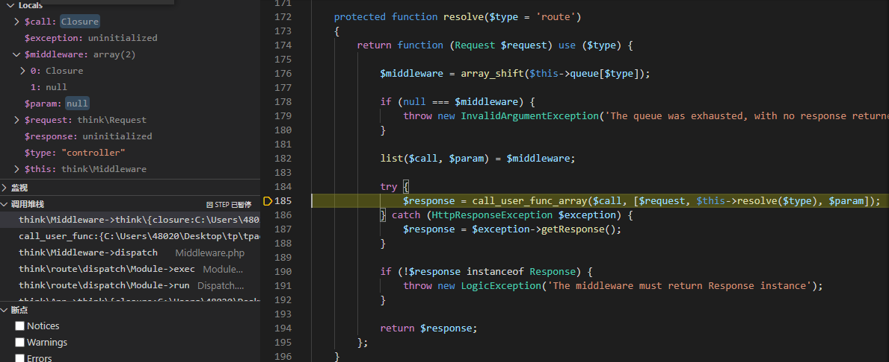

匿名函数里面是利用反射获取对应方法并执行:

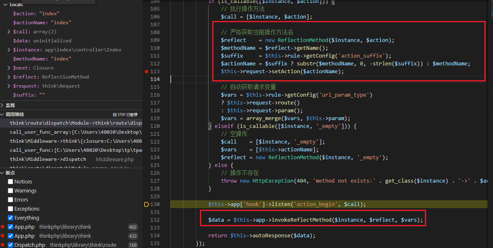

#### send()

返回结果, 主要是header信息等

## admin/index 01

访问admin/index 会触发error , 

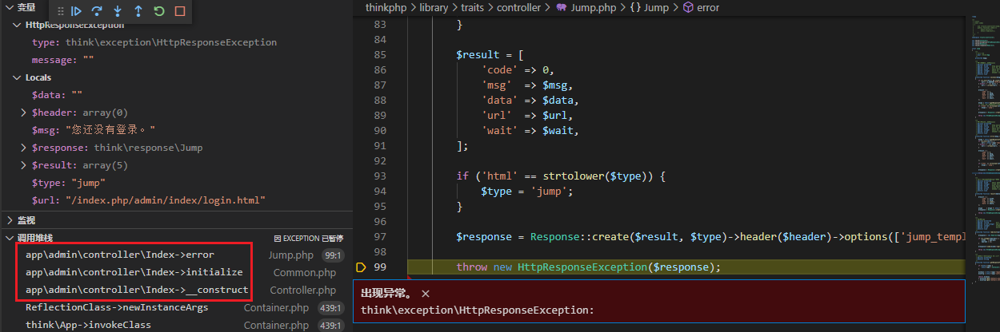

观察调用堆栈,跟踪到 initialize 方法 ,发现在Common类重写了initialize()方法,并且控制其继承的不是Controller而是Common.

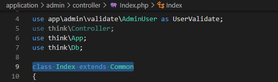

再跟到Controller的构造方法,发现在`__construct` 调用了`initialize()` 方法

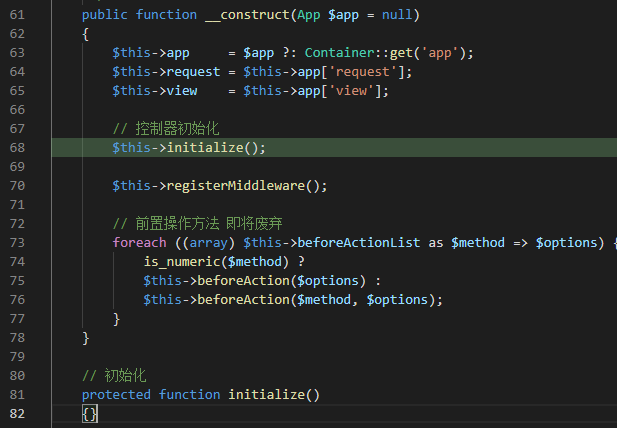

原`initialize()`方法为空,再看看重写的`initialize`方法

```php
public function initialize() // 在Controller中定义,__construct中自动调用 initialize方法
{
    if ($this->request->isPost()) {
        if ($this->request->isPost()) {
            $token = $this->getToken();
            header('X-CSRF-TOKEN: ' . $token);
            if ($token !== $this->request->header('X-CSRF-TOKEN')) {
                $this->error('令牌已过期，请重新提交。');
            }
        }
    }
    $this->auth = Auth::getInstance();
    $controller = $this->request->controller();
    $action = $this->request->action();
    if (in_array($action, $this->checkLoginExclude)) {
        return;
    }
    if (!$this->auth->isLogin()) {
        $this->error('您还没有登录。', 'Index/login');
    }
    // 在判断为已登录后，验证用户是否有权限访问
    if (!$this->auth->checkAuth($controller, $action)) {
        $this->error('您没有权限访问。');
    }
    $loginUser = $this->auth->getLoginUser();
    $this->assign('layout_login_user', ['id' => $loginUser['id'],  'username' => $loginUser['username']]);
    if (!$this->request->isAjax()) {
        $this->view->engine->layout('common/layout');
        $this->assign('layout_menu', $this->auth->menu($controller));
        $this->assign('layout_token', $this->getToken());
    }
}
```

这个函数主要4个功能:

1. 验证token

```php
if ($this->request->isPost()) {
    if ($this->request->isPost()) {
        $token = $this->getToken();
        header('X-CSRF-TOKEN: ' . $token);
        if ($token !== $this->request->header('X-CSRF-TOKEN')) {
            $this->error('令牌已过期，请重新提交。');
        }
    }
}
```

2. 登录验证

```php
$this->auth = Auth::getInstance();
$controller = $this->request->controller();
$action = $this->request->action();
if (in_array($action, $this->checkLoginExclude)) {
    return;
}
if (!$this->auth->isLogin()) {
    $this->error('您还没有登录。', 'Index/login');
}
```

如果当前请求的控制器/方法不需要登录,就直接返回,跳过下面的登陆验证

3. 权限验证

```php
// 在判断为已登录后，验证用户是否有权限访问
if (!$this->auth->checkAuth($controller, $action)) {
    $this->error('您没有权限访问。');
}
```

4. 初始化布局

```php
$loginUser = $this->auth->getLoginUser();
$this->assign('layout_login_user', ['id' => $loginUser['id'],  'username' => $loginUser['username']]);
if (!$this->request->isAjax()) {
    $this->view->engine->layout('common/layout');
    $this->assign('layout_menu', $this->auth->menu($controller));
    $this->assign('layout_token', $this->getToken());
}
```

## admin/index/login

在initialize和`    return $reflect->invokeArgs($instance, $args);`分别下一个断点就好了

一个用于观察验证,一个用于进入具体的方法

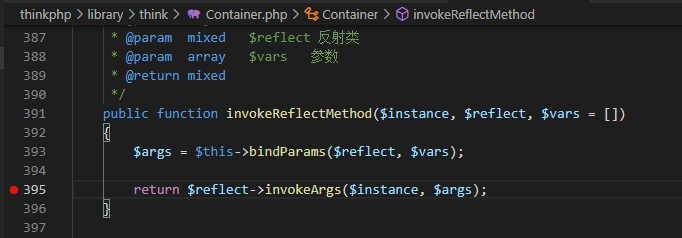

直接进入invokeArgs进入login方法

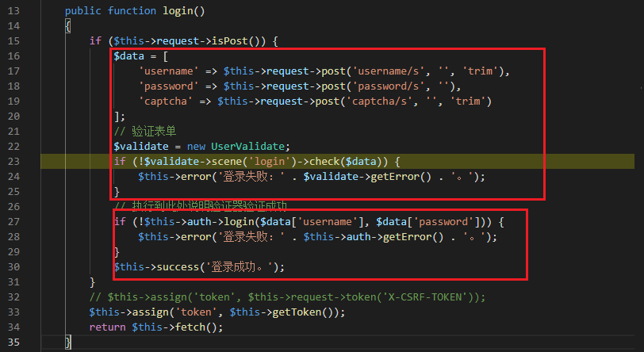

主要两个部分,第一部分是对输入进行检查验证,第二部分是检查用户名和密码

可以直接跳到UserValidate的代码直接观察验证规则,

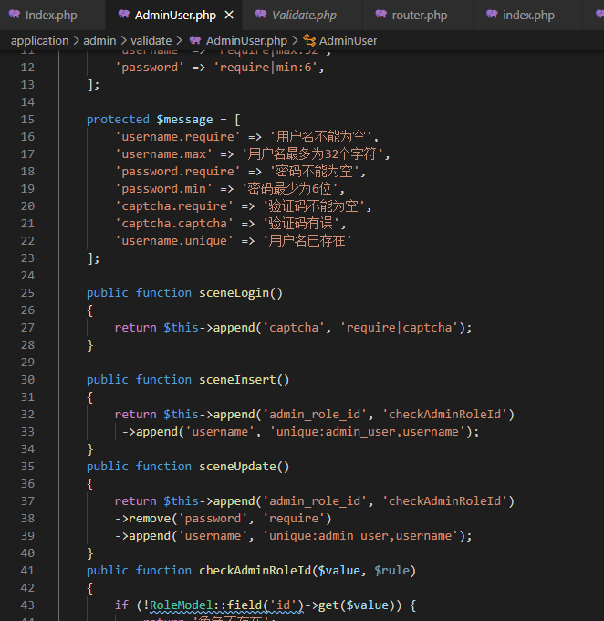

验证码部分是直接用的tp的组件, 生成是在html文件:

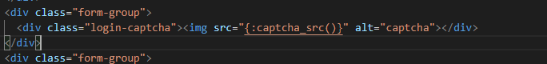

验证是在scenceLogin() ,
跟到auth->login方法,密码验证逻辑:

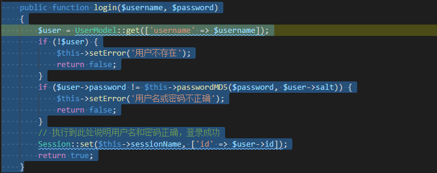

登陆后会把信息存在session里

## admin/index 02

登录之后的验证逻辑

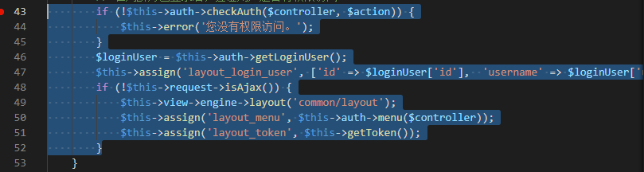

还是在initialize函数

checkAuth进行权限检查, 跟进:

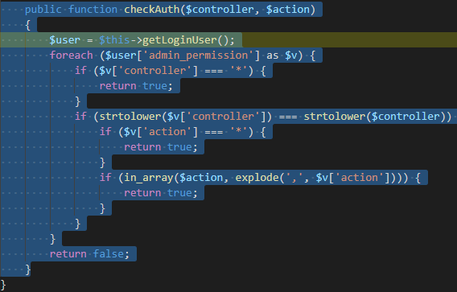

再跟进getLoginUser

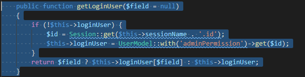

它在isLogin函数就已经调用了一次

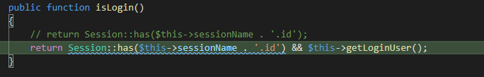

仔细看下这个函数,调用了`UserModel::with('adminPermission')->get($id)` 这个会返回与这个用户相关联的adminPremission表的信息, 这个表数据库中是下面这样的

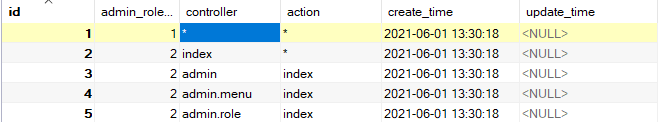

当前用户的id是1,返回的是第一列的数据, 然后再看checkAuth的代码就很容易理解了

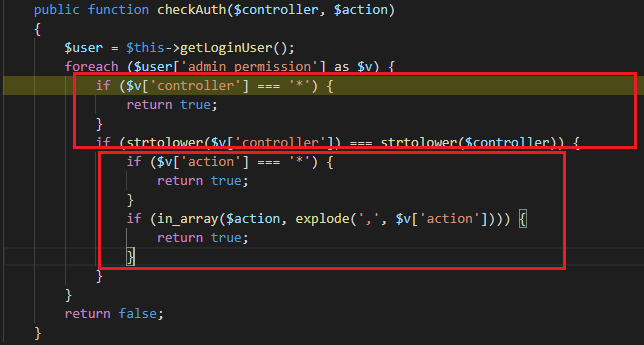

然后就是和显示面板有关的部分:

```php
$this->assign('layout_login_user', ['id' => $loginUser['id'],  'username' => $loginUser['username']]);
if (!$this->request->isAjax()) {
    $this->view->engine->layout('common/layout');
    $this->assign('layout_menu', $this->auth->menu($controller));
    $this->assign('layout_token', $this->getToken());
}
```

这里显示面板是一个树状结构, 具体就不看了~

之后就是admin/index/index方法了, 返回了一些和服务器配置有关的信息

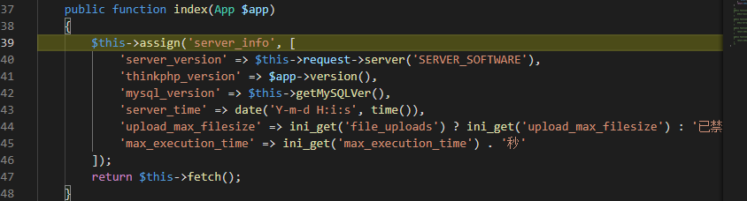

## other

别的都是一些具体功能了, 主要是权限部分和类的initialize方法需要格外注意

